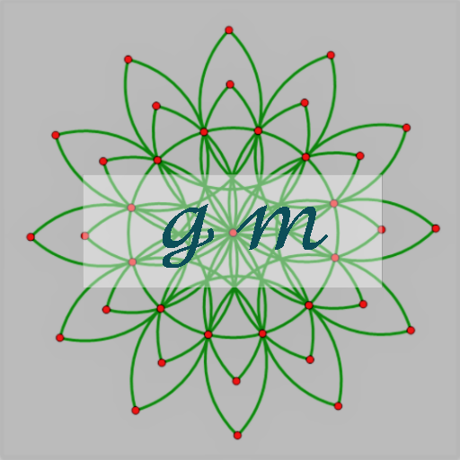

# gm

This is the gm exttension written for VS code.

author: Giacomo Zheng

作者：郑仁鹏

email: giacomo821@outlook.com

github username: [GiacomoZheng](https://github.com/GiacomoZheng/vscode-gm.git)

## Features

gm is a language basing on my writing habits of mathematics, with lots of special symbols,

<!--  -->

which looks like this one. (with the extension better-comment)

It is much more like mathemtics than a programming lauguage indeed.

## Requirements

None

If it is possible, the Windows' users can try to learn something about autoHotKey, which helps a lot.

For the Mac's and Linus' users, I'm sorry but you can try other hotkey apps.

## Extension Settings

none up to now.

<!-- ## Known Issues

Calling out known issues can help limit users opening duplicate issues against your extension. -->

## Release Notes

go to [Changelog](CHANGELOG.md) for details.

### 1.0.0

Initial release of 2018.9.14

### 1.0.1

<!-- ### 1.0.1

Fixed issue #.

### 1.1.0

Added features X, Y, and Z. -->

-----------------------------------------------------------------------------------------------------------

