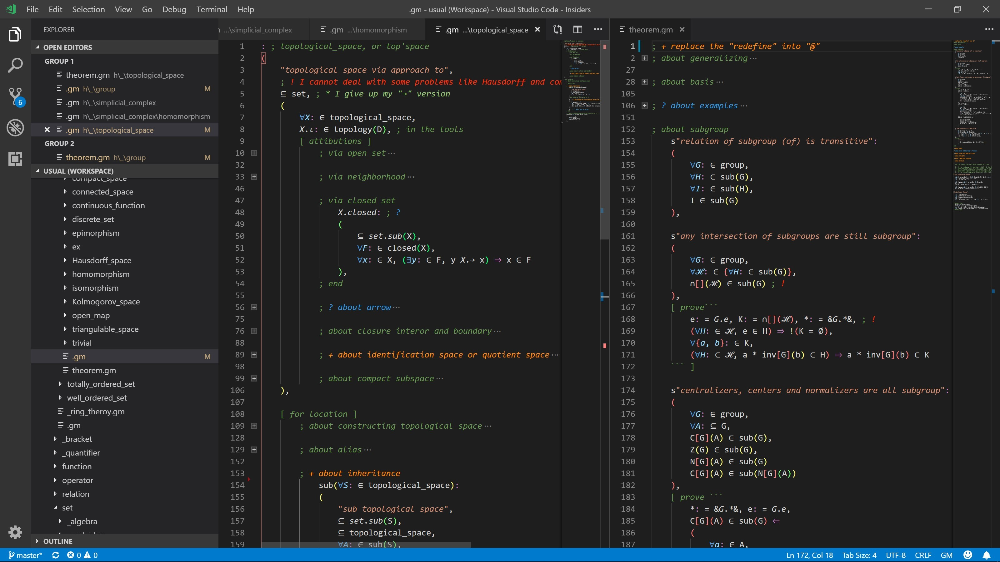

# gm

[单击此处前往中文版须知](/README.zh-cn.md)

This is the gm extension written for VS code.

<!-- Click [here](https://github.com/GiacomoZheng/gm/wiki) to the wiki of tutorials. -->

I'll rewrite the tutorial later, which will be totally different from now.

---

author: Giacomo Zheng

作者：郑仁鹏

email: giacomo821@outlook.com

Github username: [GiacomoZheng](https://github.com/GiacomoZheng/vscode-gm.git)

## Features

gm is a language basing on my writing habits of mathematics, with lots of special symbols,

which looks like this one. (with the extension `Bracket Pair Colorizer 2`)

It is much more like mathemtics than a programming lauguage indeed.

## Extension Settings

It is better to add some settings (in [settings](https://github.com/GiacomoZheng/gm-syntax/tree/main/plugins/settings/README.md)) into `settings.json`, which build in the function of `better-comments` of `aaron-bond`. I have got the permission from him.
<!-- the path of settings may be wrong -->

## Requirements

### Hotstrings

For the Windows users, you can try to learn something about [AutoHotKey](https://autohotkey.com/), which helps a lot. Go to [plugins](https://github.com/GiacomoZheng/gm-syntax/tree/main/plugins/hotstrings/autohotkey) to get my source file.

WARN: Hammerspoon is not suitable for gm lang, I will find a better option soon.

For the Mac users, I'm writting script for [Hammerspoon](http://www.hammerspoon.org). Go to [plugins](https://github.com/GiacomoZheng/gm-syntax/tree/main/plugins/hotstrings/Hammerspoon) to get my source file.

For Linus' users, you can try other hotkey apps, I'll post a `gm.toml` file in [plugins](https://github.com/GiacomoZheng/gm-syntax/tree/main/plugins/hotstrings/gm.toml).

## Recommendation

[bracket-pair-colorizer-2](https://marketplace.visualstudio.com/items?itemName=CoenraadS.bracket-pair-colorizer-2) is a beautiful and powerful extension and it support all languages. You can directly use it after intalling.

[Better Comments](https://marketplace.visualstudio.com/items?itemName=aaron-bond.better-comments) is a useful extension, but it (2.0.2) doesn't support gm directly. In the latest version of `gm` (`1.0.5`), I build in the function of the `better comments` into the sytnax, with the help of some other configurations.

## Release Notes

Go to [Changelog](CHANGELOG.md) for details.

-----------------------------------------------------------------------------------------------------------
